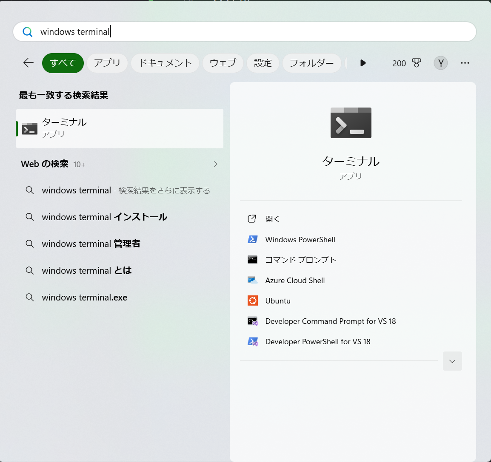
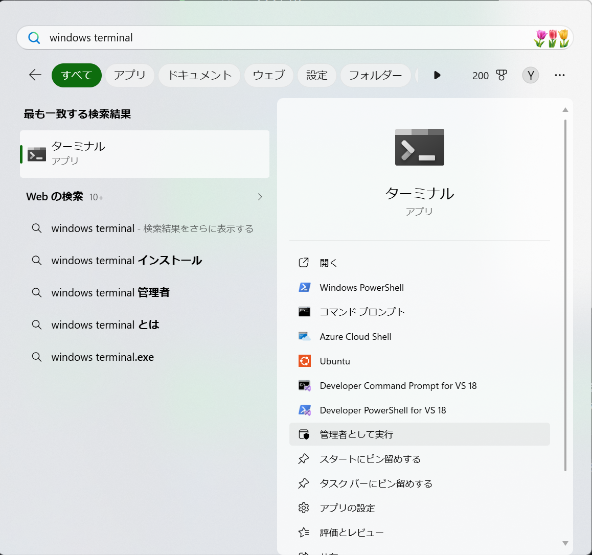

---
prev:
  text: '1. 環境構築'
  link: '/cpp/chapter-1/'
next:
  text: '2. はじめてのプログラミング'
  link: '/cpp/chapter-2/'
---

# 1.1-B Windowsの環境構築

## Step 1: WSLのインストール

1. <https://apps.microsoft.com/detail/9N0DX20HK701?hl=ja-jp&gl=JP&ocid=pdpshare>でWindows Terminalをインストールする。（既にインストールされていれば飛ばしてOK）
2. アプリ検索の画面で、`Windows Terminal`と入力し **「管理者として実行」** を押す。


:::tip
「管理者として実行」ボタンは、右下にある `∨` ボタンを押さないと表示されない場合があります。





:::
3. `wsl --install -d Ubuntu`と入力して、エンターキーを押す。


:::tip
インストール中に「この操作を完了するために、システムを再起動する必要があります」などと表示されることがあります。その際はWindowsを再起動してください。再起動後、Windows Terminalを開いて`wsl -d Ubuntu`と入力すればUbuntuのセットアップが続けられます。
:::

:::warning TA向け
WSLインストールトラブルシューティング
<https://learn.microsoft.com/ja-jp/windows/wsl/troubleshooting>

`wsl --install`に失敗した際の手動インストールマニュアル
（Windowsバージョンの要件なども書いてあります）
<https://learn.microsoft.com/ja-jp/windows/wsl/install-manual>
:::

:::warning TA向け
- 繰り返し再起動してもWSLノインストールができない場合、Windowsのアップデートを試してください。
- 極稀に、BIOSでvirtualization設定が切られている為にWSLがインストールできない事があります。（`Please enable the Virtual Machine Platform Windows feature and ensure virtualization is enabled in the BIOS.`と表示されます。）
  この場合はBIOSに入って、 Advanced -> Virtualizationの順で有効化してください。
- `wsl --install`実行中にプログレスバーが止まって見えるとき、Spaceキーを押すと画面が更新されて進行が確認できる場合があります。
:::

1. Ubuntuのアカウント設定をする。
    1. ターミナルの下部に`Enter new UNIX username:`と表示されていなければ`wsl -d Ubuntu`と入力してエンターキーを押す。
        - それでも`Enter new UNIX username:`が表示されない場合（例えば「ディストリビューションが見つからない」という内容のエラーが表示される場合）は、インストールが失敗している可能性があるのでStep 1の1. からやり直してみる。（これでも上手くいかない場合はTAを呼んでください。）

    ::: tip
    環境によっては、`Enter new UNIX username:`ではなく、`Create new UNIX User`と表示されることがあるようです。この場合でも、そのまま進めてもらって構いません。
    :::

    2. `Enter new UNIX username:`と表示されるので、**半角英数小文字**で好きなユーザーネームを設定する。（`take`とか`takemura`とか`ryugo`とか短い方が良い。フォルダの名前になります。）
    3. `New Password:`と表示されるので、WSL内で使いたいパスワードを入力。**何も表示されませんが入力されています。**入力できたら エンターキーを押す。
    4. `Retype New password:`と表示されるので、もう一度パスワードを入力する。


::: tip
パスワードは忘れないよう、どこかに記録しておきましょう。
:::

::: info
「Linux用Windowsサブシステムにようこそ」という画面が出た場合、無視して閉じて構いません。
:::

:::warning TA向け
パスワードを打ち間違えて`[y/N]`と表示された場合、`y`を入力すれば再入力できます。タブを閉じてしまいパスワードを設定できなかった際は、`wsl --unregister Ubuntu`を実行してStep1の1.からやり直してください。
:::

1. ターミナルのウィンドウを閉じる。
2. スタートからWindows Terminalを起動。
3. `Ctrl`+`,`で設定画面を開く。

::: tip
`Ctrl`+`,`で設定が開かない場合は、画面上部にあるタブバーの`∨`ボタンをクリックして「設定」を選んでください。
:::

8. 「既定のプロファイル」を「Ubuntu」に変更する。（複数あるならどれでも良い）

9. 「保存」ボタンを押す。
10. Windows Terminalを閉じて、もう一度開く。

:::warning TA向け
再起動後もUbuntuがデフォルトのプロファイルとして起動しない場合は、もう一度Windows Terminalを閉じて開き直してください。それでも解決しない場合はWindows自体の再起動を試してください。
:::

11. [traQのtasksチャンネル](https://q.trap.jp/channels/event/workshop/pg-basic/tasks)でスタンプをつける。

## Step 2: Clangのインストール

1. WSL上で`sudo apt update`と入力する。
2. パスワードを求められるので、WSLで設定したパスワードを入力する。
3. WSL上で`sudo apt install clang zip curl -y`と打つ。
4. `clang --version`でclangのバージョンが表示されれば成功！
7. [traQのtasksチャンネル](https://q.trap.jp/channels/event/workshop/pg-basic/tasks)でスタンプをつける。

## Step 3: VSCodeのインストール

1. <https://code.visualstudio.com/download>から自分のOS用のインストーラをダウンロードする。
2. ダウンロードされたインストーラを開き、画面の案内に従って、VSCodeをインストールする。
3. 起動後、`Ctrl`+`Shift`+`X`を押す。

::: info
初回起動時にログイン画面が出る場合があります。GitHubアカウントなどでログインをしても、右上の×ボタンから閉じても、どちらでも構いません。
:::

::: tip
拡張機能が表示されない・インストールできない場合は、ウィンドウの左下や上部などに「制限モード」と表示されていないか確認してみてください。

表示されている場合にはそこをクリックして、その先の画面で「信頼する」をクリックしてください。
(画像の赤枠部分)


:::

1. `Ctrl`+`,`を押して、出てきた画面に「Auto Save」と入力する。
2. 「Files: Auto Save」の項目を探して、「afterDelay」に変更する。


6. `Ctrl`+`Shift`+`X`を押して、出てきた画面に`Japanese`と入力する。

::: tip
`Ctrl`+`Shift`+`X`が反応しない場合は、左側のメニューから「拡張機能」（正方形が4つあるアイコン）を探して開いてください。
:::

7. `Japanese Language Pack for Visual Studio Code` をインストールする。
8. インストールが終わったら、右下の`Change Language and Restart`を押してVSCodeを再起動する。


9. もう一度、`Ctrl`+`Shift`+`X`を押して、出てきた画面に`WSL`と入力する。
10. `WSL` をインストールする。

11. ターミナルで `code hello.txt` を入力する。VSCodeが起動できたら成功！


::: tip
`code: command not found`と表示される場合やVSCodeが起動しない場合は、一度ターミナルを閉じて開きなおしてから再度実行してみてください。
:::

::: tip
VSCodeが起動した際、ウィンドウの左下や上部などに「制限モード」と表示される場合があります。

表示されている場合にはそこをクリックして、その先の画面で「信頼する」をクリックしてください。
(画像の赤枠部分)


:::

12.  [traQのtasksチャンネル](https://q.trap.jp/channels/event/workshop/pg-basic/tasks)でスタンプをつける。

## Step 4: 拡張機能の設定

:::warning TA向け
拡張機能が正常に動作しない場合、WSLではなくWindows側のVSCodeに拡張機能がインストールされている可能性があります。WSLのターミナルで`code`コマンドを使ってVSCodeを開いてからインストールするよう案内してください（Windows上で直接VSCodeを起動すると発生しやすいです）。
:::

1. VSCodeの画面で`Ctrl`+`Shift`+`X`を押す。
2. `C++`と入力し、「C/C++ Extension Pack」の拡張機能を追加する。
3. `Code Runner`と入力して、「Code Runner」の拡張機能を追加する。
4. `Ctrl`+`,`で設定を開く。下記画像の赤丸で囲んだ部分を押して`settings.json`を開く。


:::warning TA向け
`settings.json` の中身がほぼ空（`{}`のみ）でも問題ありません。そのまま5〜6の内容を追加すれば動作します。
:::

5. もし`"cpp": `で始まる行がなければ、一番最後の行の1つ前の行（`}`の前！）に次のコードを追加する。その前の行に`,`がなかったら追加する。

```json
"code-runner.executorMap": {
    "cpp": "cd $dir && clang++ -std=c++2b $fileName -o $fileNameWithoutExt && $dir$fileNameWithoutExt",
},
```


::: tip

もしすでに`"cpp": `で始まる行があった場合、以下のように`g++`を`clang++`に置き換える。

```diff
- "cpp": "cd $dir && g++ $fileName -o $fileNameWithoutExt && $dir$fileNameWithoutExt",
+ "cpp": "cd $dir && clang++ -std=c++2b $fileName -o $fileNameWithoutExt && $dir$fileNameWithoutExt",
```

:::

6. `"code-runner.executorMap": {`の行の前に`"code-runner.runInTerminal": true,`を書く。（コピペ推奨！！）
7. こんな感じになっていればOK！


8. WSLのターミナルを開き、`code main.cpp`と入力する。
9. 次のように書く。（コピペでもOK）

```cpp
#include <iostream>
using namespace std;

int main() {
    cout << "Hello, World!" << endl;
}
```

10. 画像の赤丸で実行してみる。下側の画面に`Hello, World!`が出れば成功！


::: tip
なにか出てきた場合は、代わりに三角の隣の`v`を押して、「Run Code」を押す！


:::

::: tip
三角のボタンが表示されない場合、ウィンドウの左下や上部などに「制限モード」と表示されていないか確認してみてください。

表示されている場合にはそこをクリックして、その先の画面で「信頼する」をクリックしてください。
(画像の赤枠部分)


:::

11. [traQのtasksチャンネル](https://q.trap.jp/channels/event/workshop/pg-basic/tasks)でスタンプをつける。
12. 環境構築はこれで完了です。お疲れ様でした！
