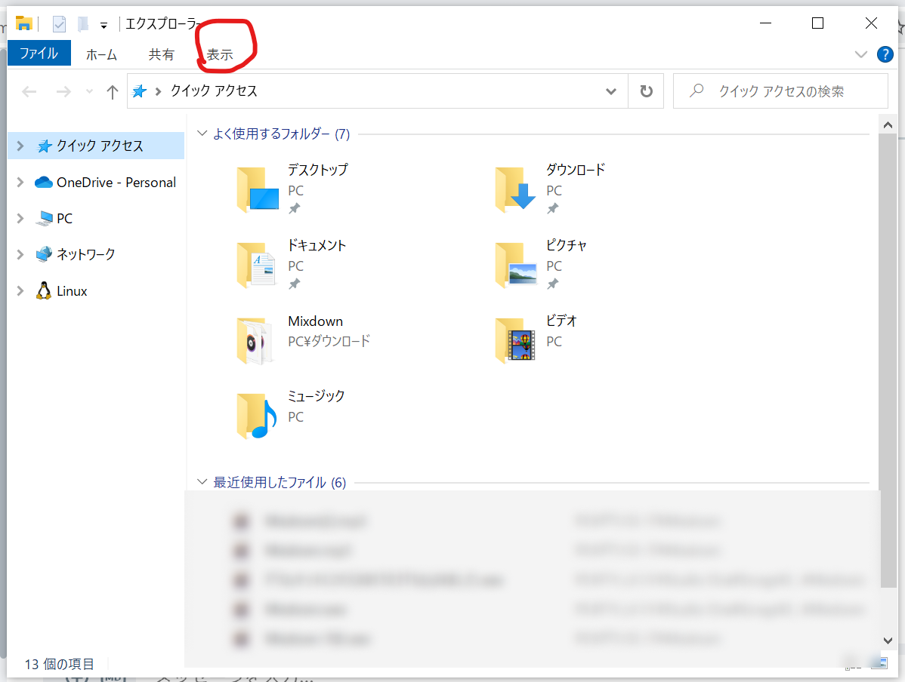
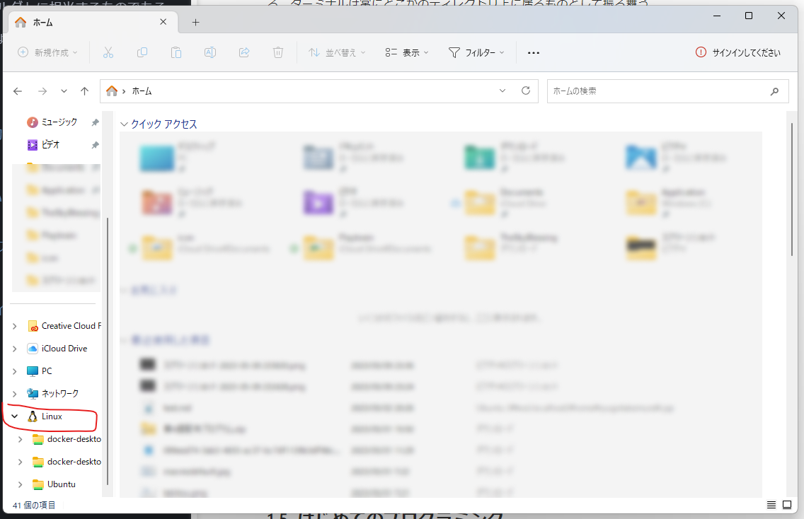

# 2.2 作業環境の構築

ここからは実際に手を動かして、作業するための場所を作っていこう。

## 2.2.1 はじめてのターミナル

まずはターミナルを開いてみよう。黒い画面に白い文字（Macでは白い画面に黒い文字）が出ていて、ここにコマンドを打ち込むことでコンピューターを直接操作することができる。
試しに`echo "Hello"`と打ち込んで改行すると、`Hello`が出力される。`echo`は、次に与えられた文字列をそのまま出力するコマンドである。

Windowsにおいては、WSLのターミナルを用いてLinuxを操作することができ、Macにおいてはターミナルを用いてコンピューターを操作することができる。
Windowsの環境構築で少し出てきた「PowerShell」はWindowsを操作するイメージ。

::: tip
`echo`は「こだま・反響」
:::

1. 「ターミナル」を起動する。
2. `echo "Hello"`と入力する。
3. `Hello` という行が表示されていればOK。

自分の画面とはおそらく違うだろうが、概ねこのような風に`Hello`が表示されれば問題ない。

## 2.2.2 ディレクトリとは

ディレクトリは、エクスプローラー（Windows）/Finder（Mac）で「フォルダ」に相当するものである。ターミナルは**常にどこかのディレクトリ上に居るものとして振る舞う。**
エクスプローラー/Finderと見比べながら、コマンドを打ち込んで理解しよう。

### ターミナルでの操作

1. ターミナルを開く。
2. ターミナルで`pwd`と打つと、現在の自分の場所がわかる。
3. ターミナルで`ls`と打つと、今居るディレクトリにあるファイル一覧が表示される。（最初はほぼないはず！）

#### エクスプローラー（Windows）

エクスプローラーを起動すると、自分のコンピューターに保存されているファイルを一覧することができる。

1. エクスプローラーを開く。
2. エクスプローラーの「表示」をクリックする。
   
3. 「ファイル名拡張子」にチェックを入れる。
4. サイドバーに「Linux」があるので、それをダブルクリックする。
   
5. 「Ubuntu」をクリックする。
6. `pwd`コマンドの結果を見ながら、「home」→「（自分の名前）」でアクセスする。

#### Finder（Mac）

Finderを起動すると、自分のコンピューターに保存されているファイルを一覧することができる。

1. Finderを開く。
2. Finderで`⌘`+`,`を押す。
3. 「詳細」→「すべてのファイル名拡張子を表示」をONにする。
4. Finderで`⌘`+`Shift`+`G`を押す。
5. `pwd`で出てきたテキストをそのまま入力する。

## 2.2.3 作業環境の構築

### コマンド紹介

- `pwd`：現在の自分の場所を表示する。 (**P**rint **W**orking **D**irectory)
- `ls`：今居るディレクトリにあるファイルの一覧を表示する。 (**l**i**s**t)
- `cd {path}`：`{path}`に移動したいディレクトリを入れることで、今居るディレクトリから`{path}`のディレクトリへ移動する。 (**C**hange **D**irectory)
  - 例えば、`cd abc`と打つと、今居るディレクトリの下にある、`abc`という名前のディレクトリに移動する。
- `cd ../`：一つ親のディレクトリに移動する
  - 例えば、今居るディレクトリが`/home/traP`なら`/home`に移動に移動する。
- `mkdir {path}`：ディレクトリを作成する (**M**a**k**e **Dir**ectory)

### 作業環境の作成

まずは、ターミナルでコマンドを打ち、作業するための場所を作成しよう。

1. ターミナルで`cd ~`と入力する。（`~`は`0`の2つ右のキー`^`+`Shift`を同時押し）
   - ホームディレクトリに移動できる。
2. ターミナルで`mkdir pgbasic`と入力する。
   - `pgbasic`というディレクトリが作られる。

### 作業環境を開く

次に、上で作った作業環境をVSCodeで開こう。

1. ターミナルで`cd pgbasic`と入力する。
   - `pgbasic`のディレクトリに移動する。
2. ターミナルで`pwd`と入力する。
   - 今いるディレクトリの場所が出力される。最後が`/pgbasic`で終わっていればOK！
3. `code main.cpp`
   - VSCodeを開く。ここが講習中の作業場所。

もしくは、VSCodeを直接起動しても前回のファイル・ディレクトリを開けるようになる。
