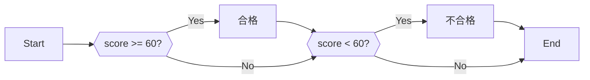
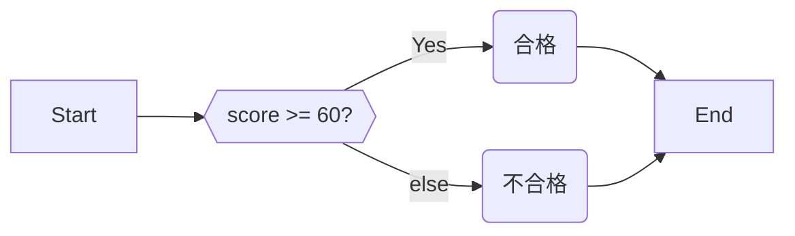
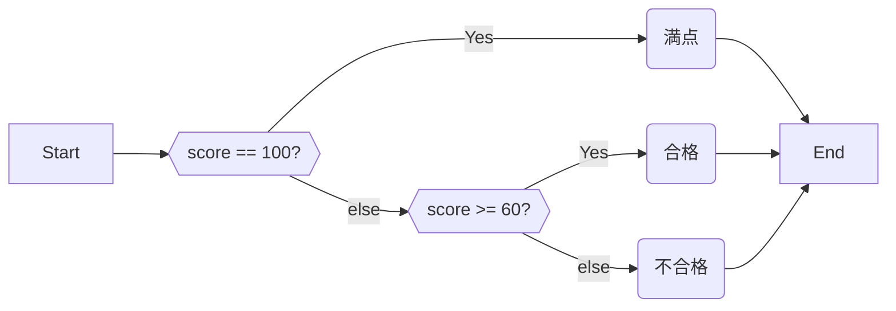

# 4.1 if文

## 4.1.1 if

何らかの処理を、**特定の条件を満たすときにだけ実行したい**場合は、if文と呼ばれる構文を用いる。`if`の後に**条件**を記し、その後の`{}`の中に条件を満たしていたときだけ実行したい命令を記述する。

以下は、入力された点数が60点以上であれば「合格」、そうでなければ「不合格」と表示するプログラムである。

```cpp:line-numbers
#include <iostream>
using namespace std;

int main() {
  cout << "点数を入力してください。" << endl;
  int score;
  cin >> score;

  if (score >= 60) {
    cout << "合格です。" << endl;
  }
  if (score < 60) {
    cout << "不合格です。" << endl;
  }
}
```

フローチャートで表すと以下のようになる。



`score >= 60`は、$score \geq 60$と同じである。`+-/*`と同じくして、条件を記述する演算子も存在する。演算子は以下の通り。

| 演算子  | 数学の記号  |
|------|--------|
| `>=` | $\geq$ |
| `>`  | $>$    |
| `<`  | $<$    |
| `<=` | $\leq$ |
| `==` | $=$    |
| `!=` | $\neq$ |

:::warning
`==`と`=`を混同しないように注意。`=`は**代入**、`==`が**等価**である。
:::

## 4.1.2 else

4.1.1で示した例は、60点以上「でない」ときを`if (score < 60)`と記述することで実装した。ただ、実際には「そうでないとき」を**else文**によって簡単に記述できる。

```cpp:line-numbers
#include <iostream>
using namespace std;

int main() {
  cout << "点数を入力してください。" << endl;
  int score;
  cin >> score;

  if (score >= 60) {
    cout << "合格です。" << endl;
  } else {
    cout << "不合格です。" << endl;
  }
}
```

::: tip
else文は、if文の終わり（=`}`）の次に書く必要がある。
:::



## 4.1.3 else if

4.1.2のコードに「満点だったら」という条件を足す。

```cpp:line-numbers
#include <iostream>
using namespace std;

int main() {
  cout << "点数を入力してください。" << endl;
  int score;
  cin >> score;

  if (score == 100) {
    cout << "満点です。" << endl;
  } else {
    if (score >= 60) {
      cout << "合格です。" << endl;
    } else {
      cout << "不合格です。" << endl;
    }
  }
}
```



ただ、このように書くのは冗長なので、`else if`と短縮する事が許されている。

```cpp:line-numbers
#include <iostream>
using namespace std;

int main() {
  cout << "点数を入力してください。" << endl;
  int score;
  cin >> score;

  if (score == 100) {
    cout << "満点です。" << endl;
  } else if (score >= 60) {
    cout << "合格です。" << endl;
  } else {
    cout << "不合格です。" << endl;
  }
}
```

こちらの方が、若干ではあるがコードを読みやすいと感じるだろう。

## 4.1.4 変数のスコープ

変数が使える範囲には制限があり、これを変数の**スコープ**と呼ぶ。

具体的には、`{}`の外からは変数にアクセスできない。

例えば次のプログラムで言えば、変数`z`は8行目から10行目まででしか使用できない。**12行目は正しく実行できない。（コンパイルエラーとなる。）**

変数`x`は5行目から13行目まで好きなところで使用できる。

```cpp:line-numbers
#include <iostream>
using namespace std;

int main() {
  int x = 8;

  if (x < 10) {
    int z = 10;
    cout << z << endl;  // OK!
    cout << x << endl;  // OK!
  }
  cout << z << endl;  // NG
  cout << x << endl;  // OK!
}

```
