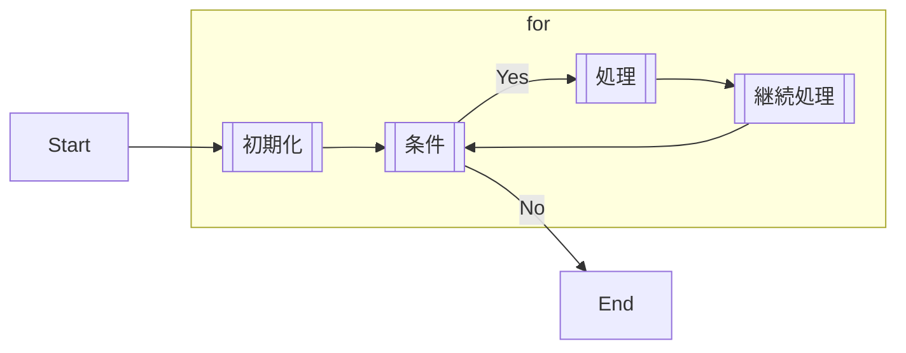
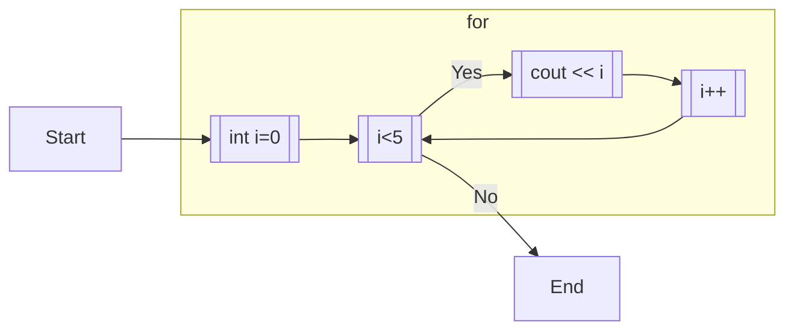

# 6.1 for文

## 6.1.1 for文の基本

繰り返しの処理には**for文**と呼ばれる構文を用いる。for文は以下のように記述できる。


```cpp:line-numbers
for (int i=0; i<5; i++) {
    cout << i << endl;
}
```

このプログラムの出力は以下のようになる。

```Output:line-numbers
0
1
2
3
4
```

コードの中に`i++`と書かれている部分がある。これは**変数iの値を1増やす**演算（インクリメント）であり、`i = i+1;`と同値である。

for文がどのように動作しているかを解説する。for文は、`for`の後に`;`区切りで3つの情報を指定している。

```cpp:line-numbers
for ([初期化];[条件];[継続処理]) {
  [実行文]
}
```



例示したコードで当てはめると以下のようになる。



つまり、0, 1, 2, 3, 4の整数を出力するプログラムである。したがって、以下のようなコードも、上のコードと全く同じ出力となる。

```cpp:line-numbers
for (int i=1; i<=5; i++) {
    cout << i-1 << endl;
}
```

```cpp:line-numbers
for (int count=10; count<15; count++) {
    cout << count-10 << endl;
}
```

```cpp:line-numbers
for (int num=0; num<10; num+=2) {
    cout << num/2 << endl;
}
```

```cpp:line-numbers
for (int x=5; x>0; x--) {
    cout << 5-x << endl;
}
```

`i--`は`i -= 1`や`i = i-1`と同じ意味であり、デクリメントと呼ばれる。

for文において、初期化で定義した変数のスコープはそのfor文内となる。

for文の初期化は省略することもできる。以下は初期化を省略した例である。この例では、変数`i`をfor文の外でも使うことができる。

```cpp:line-numbers
int i = 0;
for (; i<5; i++) {
    cout << i << endl;
}
```

for文を使えば、階乗や累乗なども計算できる。

## 6.1.2 多重ループ

for文の中にfor文を入れ子にすることもできる。以下は2重ループの例である。

```cpp:line-numbers
for (int i=0; i<2; i++) {
  for (int j=0; j<3; j++) {
    cout << i << " " << j << endl;
  }
}
```

```Output:line-numbers
0 0
0 1
0 2
1 0
1 1
1 2
```

外側のfor文と内側のfor文で、繰り返しに使う変数名を同じにしてしまわないよう、注意しよう。繰り返しに使う変数には、`i`が使われることが多い。また、多重ループでは、`i`, `j`, `k`...と続けていくが多い。しかし、これらはあくまでも慣習的なものであり、必ずしも従わなければいけない、というわけではない。変数名は自由につけることができる。


