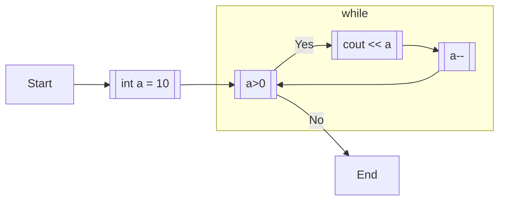

# 6.2 while文

## 6.2.1 while文とは

**条件を満たすまで**処理を繰り返したい、というときには`while`文を用いる。while文は、`while`の後にある`()`内の条件文が、真の間実行される繰り返し処理である。

```cpp:line-numbers
int a = 10;
while (a > 0) {
  cout << a << endl;
  a--;
}
```

上記のコードだと、10,9,8,7,6,5,4,3,2,1と順に出力される。


