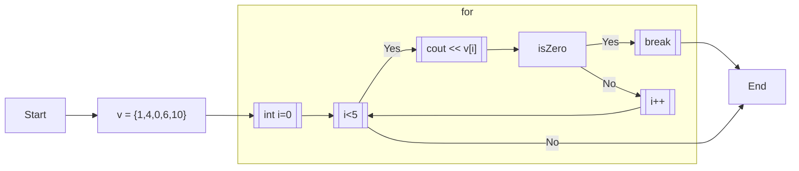
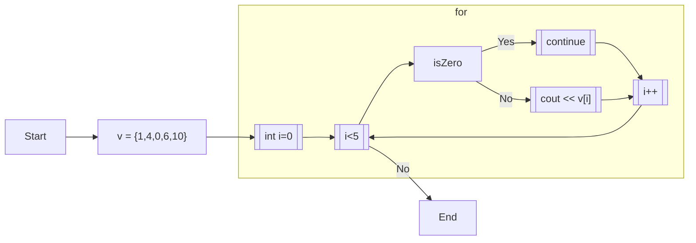

# 6.5 continueとbreak

## 6.5.1. break

for文・while文はbreakを用いて途中で終了して抜け出すことができる。

```cpp:line-numbers
vector<int> v = {1, 4, 0, 6, 10};

for (int i=0; i<v.size(); i++) {
  cout << v[i] << endl;
  if (v[i] == 0) {
    break;
  }
}
```

```
[output]
1
4
0
```



## 6.5.2. continue

continueを用いると、ループの現在のステップを飛ばして、次のステップに進むことができる。

```cpp:line-numbers
vector<int> v = {1, 4, 0, 6, 10};

for (int i=0; i<v.size(); i++) {
  if (v[i] == 0) {
    continue;
  }
  cout << v[i] << endl;
}
```


