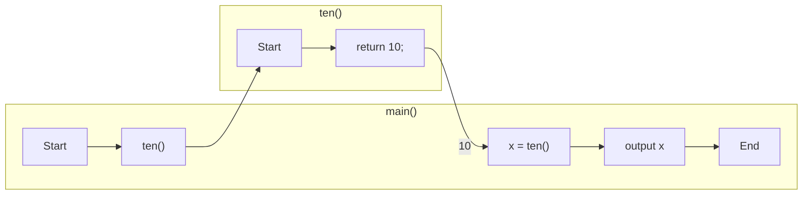

# 5.3. 返り値

逆に、関数が値を返すときは以下のように実装する。

```go:line-numbers
import "fmt"


func ten() int {
    return 10
}

func main() {
    x := ten()

    fmt.Println(x)
}
```

```
[output]
10
```

この時、この「10」を **返り値** と呼ぶ。（10 を return する → 10 を返す）



返り値の型は、関数名の前で宣言している。引数の話とまとめると、関数の定義方法は次の通り。

```go
<返り値の型> <関数名> ([引数の名前、型]) {...
```

返り値の型も自分で好きなように宣言できる。ただし複数の返り値を返すことはできない。

main 関数の返り値 は int 型である。他の関数の返り値はすべて呼び出した側に渡されるように、main 関数の返り値は OS
に渡される。このOSに渡す値は「終了コード」と呼ばれ、正常時は 0 を返すことが定められている。

なので本来ならば main 関数にも関数末尾に `return 0`
を書かなければならないが（そういうテキストも多い）、それを省略しても良いという事になっている（省略すると末尾に `return 0`
が自動的に追加される）。

返り値の型を返さない場合は、**void** 型を用いる。この場合、`return` 文は省略できる。（書きたい場合は `return;` と書く）。

```go:line-numbers
import "fmt"


func hello() {
    fmt.Println("Hello!")
}

func main() {
    hello()
}
```

----

引数と返り値を組み合わせることで、数学のような関数が実装できる。

```go:line-numbers
import "fmt"

func square(n int) int {
    return n*n
}

func main() {
    fmt.Println(square(10))
}
```

```
[output]
100
```

この `square` 関数は、引数 $n$ を受け取り、 $n^2$ を返す関数である。
