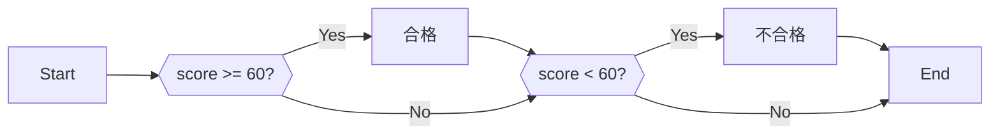
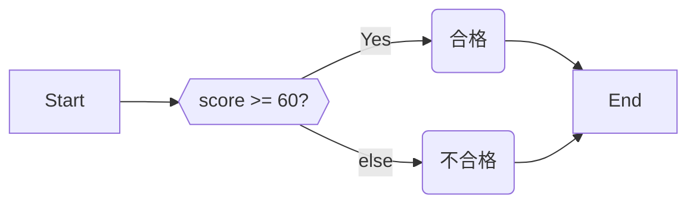
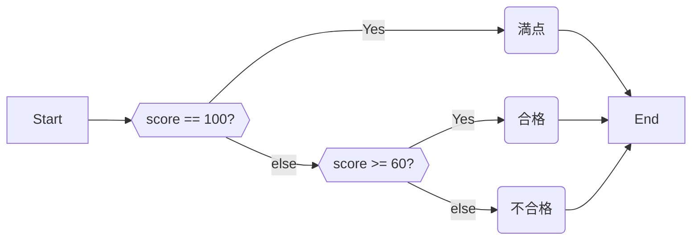

# 3.1. 条件分岐

## 3.1.1. If

特定の条件を満たす時だけ実行したい時は、if 文を用いる。if の後に条件を記し、その後の `{}` に条件を満たしていた時だけ実行したい命令を記述する。

以下は、入力された点数が点数が60点以上であれば「合格」、そうでなければ「不合格」と表示するプログラムである。

```cpp:line-numbers
#include <iostream>
using namespace std;

int main() {
  cout << "点数を入力してください。" << endl;
  int score = 0;
  cin >> score;

  if (score >= 60) {
    cout << "合格です。" << endl;
  }
  if (score < 60) {
    cout << "不合格です。" << endl;
  }
}
```

フローチャートで表すと以下のようになる。



`score >= 60` は、 $score \geq 60$ と同じである。 `+-/*` と同じくして、条件を記述する演算子も存在する。演算子は以下の通り。

| 演算子  | 数学の記号  |
|------|--------|
| `>=` | $\geq$ |
| `>`  | $>$    |
| `<`  | $<$    |
| `<=` | $\leq$ |
| `==` | $=$    |
| `!=` | $\neq$ |

:::warning
`==` と `=` を混同しないように注意。 `=` は**代入** 、 `==` が**等価** である。
:::

## 3.1.2. else 文

3.1.1. で示した例は、60点以上「でない」ときを `if (score < 60)` と記述することで実装した。ただ、実際には「そうでない時」を else
文によって簡単に記述できる。

```cpp:line-numbers
#include <iostream>
using namespace std;

int main() {
  cout << "点数を入力してください。" << endl;
  int score = 0;
  cin >> score; 

  if (score >= 60) {
    cout << "合格です" << endl;
  } else {
    cout << "不合格です" << endl;
  }
}
```

::: tip
else 文は、if文の終わり（ = `}` ）の次に書く必要がある。
:::



## 3.1.3. else if

3.1.2. のコード に「満点だったら」という条件を足す。

```cpp:line-numbers
#include <iostream>
using namespace std;

int main() {
  cout << "点数を入力してください。" << endl;
  int score = 0;
  cin >> score;

  if (score == 100) {
    cout << "満点です" << endl;
  } else {
    if (score >= 60) {
      cout << "合格です" << endl;
    } else {
      cout << "不合格です" << endl;
    }
  }
}
```



ただ、このように書くのは冗長なので、`else if` と短縮する事が許されている。

```cpp:line-numbers
#include <iostream>
using namespace std;

int main() {
  cout << "点数を入力してください。" << endl;
  int score = 0;
  cin >> score;

  if (score == 100) {
    cout << "満点です" << endl;
  } else if (score >= 60) {
    cout << "合格です" << endl;
  } else {
    cout << "不合格です" << endl;
  }
}
```

こちらの方が、若干ではあるがコードを読みやすいと感じるだろう。

## 3.1.4. or and not

条件が1つの変数のみに依存する時は `if` と `else` でわかりやすく書けた。
しかし、条件が2つ以上になるとif と else だけでは煩雑になっていく。
数学では「または」、「かつ」 「でない」（$\lor,\land, \lnot$） をよく使ったと思うが、プログラミングでもそれに当たるものが存在する。

| 演算子  | 意味  | 意味・数学記号     |
|------|-----|-------------|
| `&&` | AND | かつ $\land$  |
| `    |     | `           | OR   | または $\lor$ |
| `!`  | NOT | でない $\lnot$ |

```cpp:line-numbers
int x = 8;
int y = 5;

if (x < 10 && y < 10) {
  cout << "x も y も 10より小さい" << endl;
}
if (!(y >= 10)) {
  cout << "y は 10 より大きくない" << endl;
}
```

## 3.1.5. 変数のスコープ

変数が使える範囲には制限があり、これを変数のスコープと呼ぶ。

具体的には、 `{}` の外からは変数にアクセスできない。

例えば次のソースコードで言えば、 変数 `z` は 4 ~ 6 行目でしか使用できない。
**8 行目は正しく実行できない。（コンパイルエラーとなる）**

変数 `x` は 1行目から 9 行目まで好きなところで使用できる。

```cpp:line-numbers
int x = 8;

if (x < 10) {
  int z = 10;
  cout << z << endl; // OK !
  cout << x << endl; // OK !
}
cout << z << endl; // NG
cout << x << endl; // OK !
```

## 3.1.6. 演算子の優先順位

数学と同じように、演算子には優先順位がついている。優先順位自体は覚えなくても良いが、たまに優先順位が自分の想定と違うときがある。そのようなときは `()`
で式をくくることで、計算順序を変えられるので覚えると良い（数学と同じ）。

特に、 `<<` は比較演算子より優先順位が高い。
`cout << a <= b << endl;` と書くとコンパイルエラーとなってしまうので2行目のように書かなければならない。

```cpp:line-numbers
cout << ((a + b) * c) << endl;
cout << (a <= b) << endl;
```

::: tip
「じゃあ `<<` 演算子の優先度を一番低くすればいいじゃん」と思ったかもしれない。
しかし、実際には複雑な事情があるのだ……。
:::