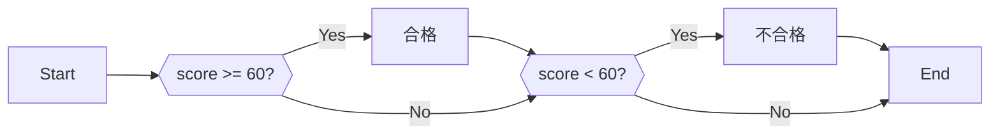
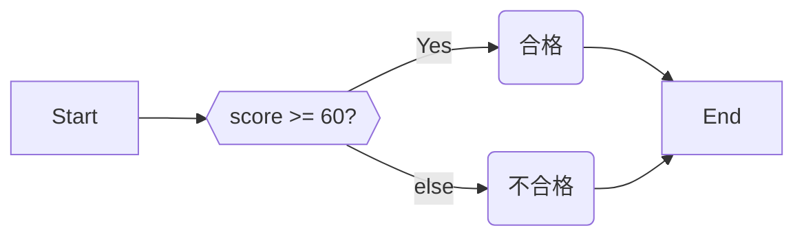
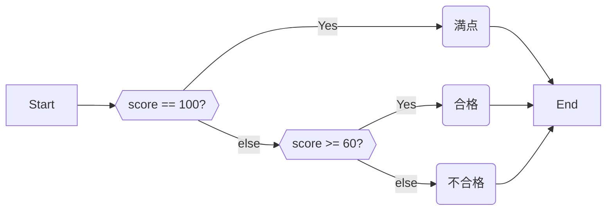

# III. 演算・計算

## 3.1. 条件分岐

### 3.1.1. If

特定の条件を満たす時だけ実行したい時は、if 文を用いる。if の後に条件を記し、その後の `{}` に条件を満たしていた時だけ実行したい命令を記述する。

以下は、入力された点数が点数が60点以上であれば「合格」、そうでなければ「不合格」と表示するプログラムである。

```cpp:line-numbers
#include <iostream>
using namespace std;

int main() {
  cout << "点数を入力してください。" << endl;
  int score = 0;
  cin >> score;

  if (score >= 60) {
    cout << "合格です。" << endl;
  }
  if (score < 60) {
    cout << "不合格です。" << endl;
  }
}
```

フローチャートで表すと以下のようになる。



`score >= 60` は、 $score \geq 60$ と同じである。 `+-/*` と同じくして、条件を記述する演算子も存在する。演算子は以下の通り。

| 演算子  | 数学の記号  |
|------|--------|
| `>=` | $\geq$ |
| `>`  | $>$    |
| `<`  | $<$    |
| `<=` | $\leq$ |
| `==` | $=$    |
| `!=` | $\neq$ |

:::warning
`==` と `=` を混同しないように注意。 `=` は**代入** 、 `==` が**等価** である。
:::

### 3.1.2. else 文

3.1.1. で示した例は、60点以上「でない」ときを `if (score < 60)` と記述することで実装した。ただ、実際には「そうでない時」を else
文によって簡単に記述できる。

```cpp:line-numbers
#include <iostream>
using namespace std;

int main() {
  cout << "点数を入力してください。" << endl;
  int score = 0;
  cin >> score; 

  if (score >= 60) {
    cout << "合格です" << endl;
  } else {
    cout << "不合格です" << endl;
  }
}
```

::: tip
else 文は、if文の終わり（ = `}` ）の次に書く必要がある。
:::



### 3.1.3. else if

3.1.2. のコード に「満点だったら」という条件を足す。

```cpp:line-numbers
#include <iostream>
using namespace std;

int main() {
  cout << "点数を入力してください。" << endl;
  int score = 0;
  cin >> score;

  if (score == 100) {
    cout << "満点です" << endl;
  } else {
    if (score >= 60) {
      cout << "合格です" << endl;
    } else {
      cout << "不合格です" << endl;
    }
  }
}
```



ただ、このように書くのは冗長なので、`else if` と短縮する事が許されている。

```cpp:line-numbers
#include <iostream>
using namespace std;

int main() {
  cout << "点数を入力してください。" << endl;
  int score = 0;
  cin >> score;

  if (score == 100) {
    cout << "満点です" << endl;
  } else if (score >= 60) {
    cout << "合格です" << endl;
  } else {
    cout << "不合格です" << endl;
  }
}
```

こちらの方が、若干ではあるがコードを読みやすいと感じるだろう。

### 3.1.4. or and not

条件が1つの変数のみに依存する時は `if` と `else` でわかりやすく書けた。
しかし、条件が2つ以上になるとif と else だけでは煩雑になっていく。
数学では「または」、「かつ」 「でない」（$\lor,\land, \lnot$） をよく使ったと思うが、プログラミングでもそれに当たるものが存在する。

| 演算子  | 意味  | 意味・数学記号     |
|------|-----|-------------|
| `&&` | AND | かつ $\land$  |
| `    |     | `           | OR   | または $\lor$ |
| `!`  | NOT | でない $\lnot$ |

```cpp:line-numbers
int x = 8;
int y = 5;

if (x < 10 && y < 10) {
  cout << "x も y も 10より小さい" << endl;
}
if (!(y >= 10)) {
  cout << "y は 10 より大きくない" << endl;
}
```

### 3.1.5. 変数のスコープ

変数が使える範囲には制限があり、これを変数のスコープと呼ぶ。

具体的には、 `{}` の外からは変数にアクセスできない。

例えば次のソースコードで言えば、 変数 `z` は 4 ~ 6 行目でしか使用できない。
**8 行目は正しく実行できない。（コンパイルエラーとなる）**

変数 `x` は 1行目から 9 行目まで好きなところで使用できる。

```cpp:line-numbers
int x = 8;

if (x < 10) {
  int z = 10;
  cout << z << endl; // OK !
  cout << x << endl; // OK !
}
cout << z << endl; // NG
cout << x << endl; // OK !
```

## 3.2. 演算子の優先順位

数学と同じように、演算子には優先順位がついている。優先順位自体は覚えなくても良いが、たまに優先順位が自分の想定と違うときがある。そのようなときは `()`
で式をくくることで、計算順序を変えられるので覚えると良い（数学と同じ）。

特に、 `<<` は比較演算子より優先順位が高い。
`cout << a <= b << endl;` と書くとコンパイルエラーとなってしまうので2行目のように書かなければならない。

```cpp:line-numbers
cout << ((a + b) * c) << endl;
cout << (a <= b) << endl;
```

::: tip
「じゃあ `<<` 演算子の優先度を一番低くすればいいじゃん」と思ったかもしれない。
しかし、実際には複雑な事情があるのだ……。
:::

## 3.3. 型

### 3.3.1 bool

何気なく if 文の中に `score >= 60` と書いているが、これ自体も `+` の演算などと同じように実際は値が定まっている。

if 文の前に `cout` を挟んで、どんな値が出力されるか確かめてみよう。

```cpp:line-numbers
#include <iostream>
using namespace std;

int main() {
  cout << "点数を入力してください。" << endl;
  int score = 0;
  cin >> score;

  cout << (score >= 60) << endl;
  if (score >= 60) {
	cout << "合格です" << endl;
  } else {
    cout << "不合格です" << endl;
  }
}
```

返り値は `1` もしくは `0` である。真のときに `1` となり、偽のときに `0` となる。
この0と1のみを持つ型を bool 型と呼ぶ。

bool型の変数を使って、コードを以下のように書き換える事ができる。

```cpp:line-numbers
#include <iostream>
using namespace std;

int main() {
  cout << "点数を入力してください。" << endl;
  int score = 0;
  cin >> score;

  bool isGood = score >= 60;
  if (isGood) {
    cout << "合格です" << endl;
  }
  if (!isGood) {
    cout << "不合格です" << endl;
  }
}
```

### 3.3.2. double

小数について扱いたい時もあるだろう。小数は `double` 型によって表される。

```cpp
double y = 3.5;
```

#### 3.3.2.1. 小数型に潜む罠

小数型は基本的に扱わない方が良いと言われている。以下のコードを見て欲しい。

```cpp:line-numbers
double x = 0.1;
double y = 0.2;
double z = 0.3;
bool b = x+y == z;

cout << b << endl;
```

このコードの出力を考えて欲しい。明らかに `true` なはずである。
しかし、実際に実行してみると `false` と表示される。

これは簡潔に言ってしまえば **double 型は2進数の小数に近似する型** だからである。

おそらく高校数学で勉強したと思うが、10進数の世界において 2 と 5 以外を因数に持つ整数で 1 を割った時、それは循環小数になる。
（例： $\dfrac13=0.\dot3_{(10)}=0.3333..._{(10)}$ ）

コンピューターの扱う 2 進数の世界でも同じ事が言えて、2進数で `0.1` や `0.2` 等の値は循環小数となる。
（例えば $0.2_{(10)}=0.\dot001\dot1_{(2)}=0.00110011..._{(2)}$ ）

この時、コンピューターは小数をある程度の位で打ち切って、値を丸め込んで保存する。この時に誤差が発生してしまい、故に上記のコードは `false`
を出力するのである。

実際に `x+y` の値を出力すると良いだろう。

```cpp:line-numbers
double x = 0.1;
double y = 0.2;

cout << x+y << endl;
```

```
[output]
0.30000000000000004
```

その為に、小数値を使って**正確な**演算をするのは基本的には**避けた方が良い**
と言われる。例えば単位の60点を超えているかどうかの判定で、60点ぴったりなはずだったのに誤差の関係で不合格と言われたらたまったものではない。
（ゲーム製作においては座標計算の都合でどうしても小数を使うのだが…）

ちなみに、整数でデータを上手に持つ事で小数を正確に扱う方法もある。（例えば 分母と分子で 2
変数を持ってしまえば、有理数は常に正確に計算できる）。また、有理数・有限小数を正確に扱えるパッケージ（ライブラリ）も存在する。

### 3.3.3. string ①

文字列も変数として扱うことができる。

C++言語において、文字列を扱うときには `string` をインクルードする必要がある。

```cpp:line-numbers
#include <iostream>
#include <string>

using namespace std;
...
```

文字列は `string` 型によって表される。

```cpp:line-numbers
string s = "Hello World!";
string t = "Hello traP!";
string empty = ""; // 文字列は空でも良い
```

整数と同じようにして、入出力ができる。

```cpp:line-numbers
string s = "";
cin >> s;
cout << s << endl;
```

`+` によって string 型同士を結合させる事ができる。

```cpp:line-numbers
string s = "Hello";
string t = "World!";
string str = s + " " + t;
cout << str << endl;
```

```
[output]
Hello World!
```

`==` で一致判定もできる。大文字と小文字は異なるものとして判定される。

```cpp:line-numbers
string s = "traP";
string t = "trap";

if (s == t) {
  cout << "Same!" << endl;
} else {
  cout << "different" << endl;
}
```

```
[output]
different
```

他にも文字列に対して `>=` 、 `<=` などの演算が定義されているが、これは次章で少しだけ扱う（本日の講習は（予定通りなら）ここで終わるので、余裕があれば自分で色々調べてみても良いだろう）。

::: tip III 章まとめ

* if 文、else 文で条件分岐ができます。
* `if(x==0)` はどのような条件を表していますか？ `==` は比較、 `=` は代入です。
* bool 型は 0 か 1 の値を持つ型です。
* `<` `>` `<=` `>=` で大小の比較ができます。
* `&&` `||` `!` で AND, OR, NOT を扱えます。
* `double` は小数型、 `string` は文字列型です。

:::

::: info
[**\[ III の練習問題へ\]**](https://md.trap.jp/IE4NUAc_RR-USMIXlevsgA#Section-III)

[**\[講習会ページに戻る\]**](https://wiki.trap.jp/Event/welcome/23/lecture/pg-basic)
:::

