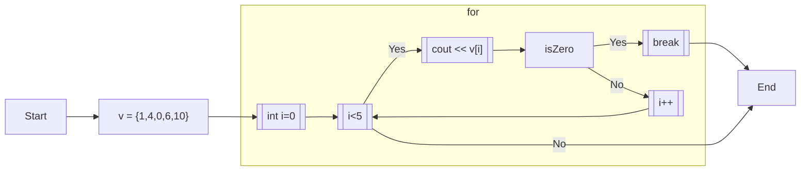
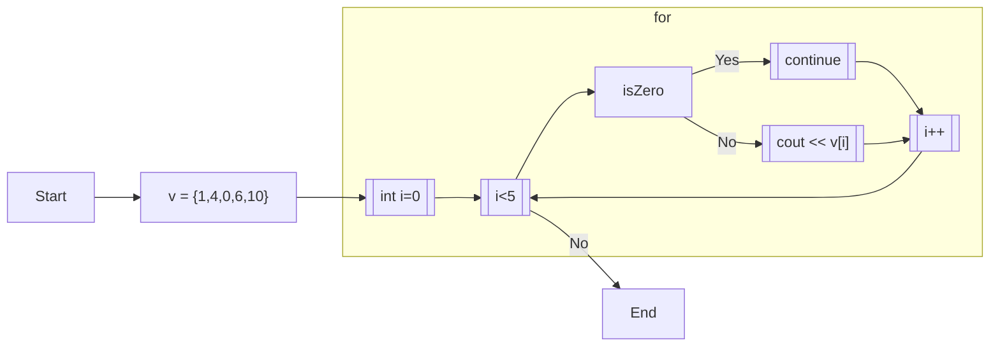

# 4.5. for ②

## 4.5.1. break

for文・while 文はbreakを用いて途中で終了して抜け出すことができる。

```cpp:line-numbers
vector<int> v = {1, 4, 0, 6, 10};

for (int i=0; i<v.size(); i++) {
  cout << v[i] << endl;
  if (v[i] == 0) {
    break;
  }
}
```

```
[output]
1
4
0
```



## 4.5.2. continue

continueを用いると、ループの現在のステップを飛ばして、次のステップに進むことができる。

```cpp:line-numbers
vector<int> v = {1, 4, 0, 6, 10};

for (int i=0; i<v.size(); i++) {
  if (v[i] == 0) {
    continue;
  }
  cout << v[i] << endl;
}
```



## 4.5.3. 多重ループ

```cpp:line-numbers
for (int i=0; i<2; i++) {
  for (int j=0; j<3; j++) {
    cout << i << " " << j << endl;
  }
}
```

```
[output]
0 0
0 1
0 2
1 0
1 1
1 2
```

for 文の内側に更に for 文を書いて、二重 for を書くことができる。
また、配列の配列という形で二次元配列を作ることもできる。（オセロ盤みたいなイメージ）

```cpp:line-numbers
vector<vector<int>> v = {
  {1, 2, 3, 4},
  {3, 5, 1, 2},
  {10, 20, 10, 20},
};
```

::: info
[**\[ IV の練習問題へ\]**](https://md.trap.jp/IE4NUAc_RR-USMIXlevsgA#Section-IV)

[**\[講習会ページに戻る\]**](https://wiki.trap.jp/Event/welcome/23/lecture/pg-basic)
:::

