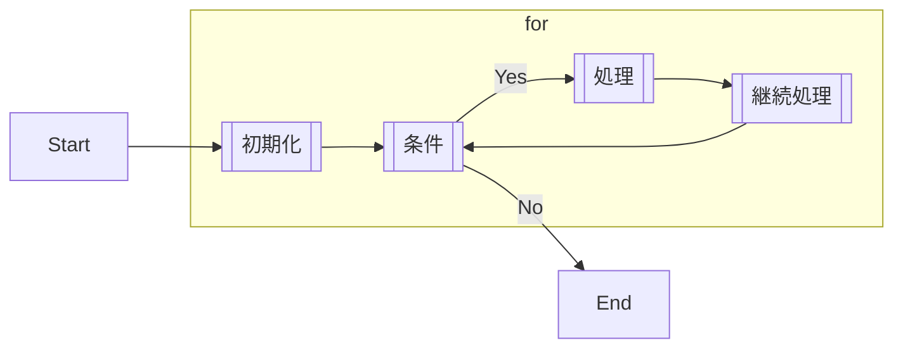
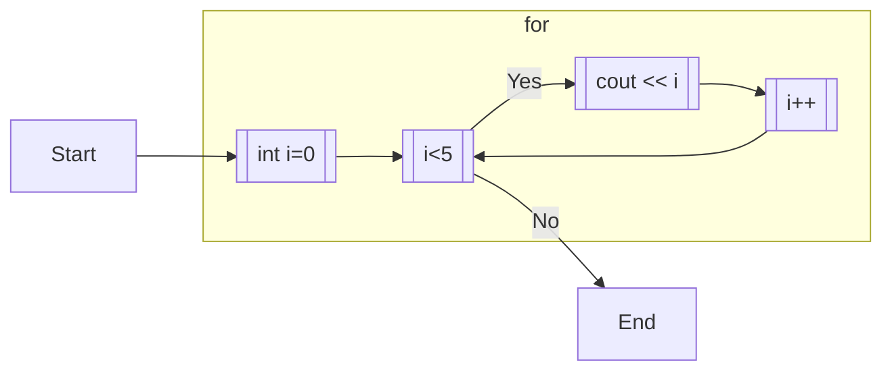

# 4.1. for ①

繰り返しの処理 `for` は以下のように記述する。

```cpp:line-numbers
for (int i=0; i<5; i++) {
    cout << i << endl;
}
```

```
[output]
0
1
2
3
4
```

新しい演算`++` が出ているが、これは **変数の値を1増やす** という演算である。 `i = i+1;` と同値。

for 文がどのように動作しているかを解説すると、`for` の後に `;` 区切りで 3 つ情報を指定している。

```cpp
for ([初期化];[条件];[継続処理]) {
	[実行文]
}
```



例示したコードで当てはめると以下のようになる。



つまり、0,1,2,3,4 の整数を出力するプログラムである。これを使えば、例えば $7^4$ 等がプログラムで計算できる。