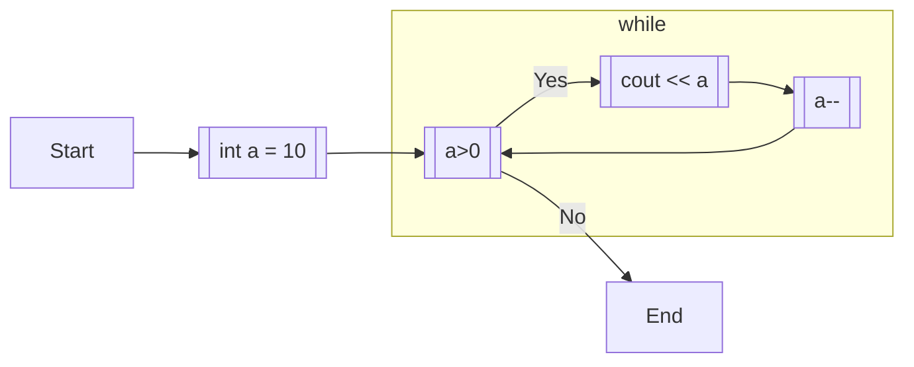

# 4.2. while

```cpp:line-numbers
int a = 10;
while (a > 0) {
  cout << a << endl;
  a--;
}
```

while文は、 `while` の中の条件文が真の間実行される繰り返し処理。

上記のコードだと、 10,9,8,7,6,5,4,3,2,1 と順に出力される。



```flow
st=>start: Start
e=>end: End

while=>operation: while
init=>operation: int a = 10
cond=>condition: a>0
cont=>operation: a--
work=>operation: cout << a

st->init->while->cond
work->cont(left)->cond

cond(yes, down)->work
cond(no)->e
```

