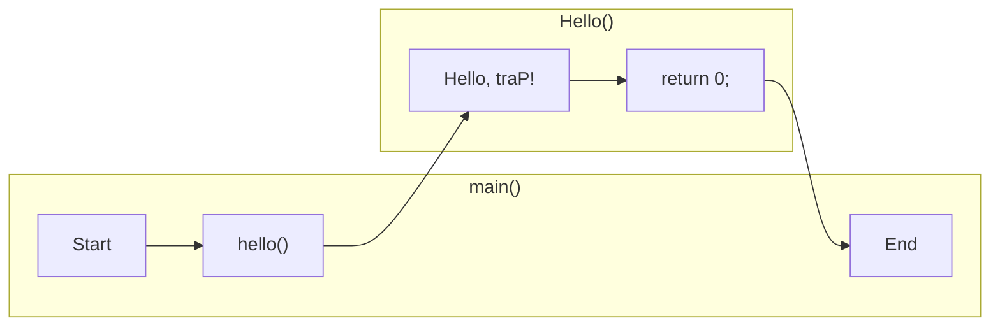
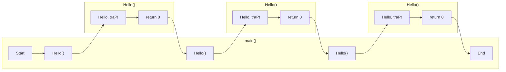
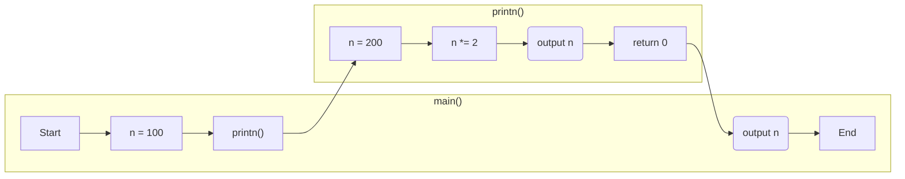

# 5.1. プログラミングの関数

数学における「関数」とは、$f(x)$ 等のように表してある値（この例では $x$ ）によって値 $f(x)$ が決まるものであった。

プログラミングにおいてはこれと少し似ているが、ある値を与えた時に、**決められた処理をして**、ある値を返すものを**関数**
と呼ぶ。ここで、関数は値を与える必要はないし、また値を返さなくても良い（決められた処理がなくても良い）という事に注意すること。

C++言語において、関数は以下のように記述する。

```cpp:line-numbers
#include <iostream>
using namespace std;

int hello() {
    cout << "Hello, traP!" << endl;
    return 0;
}

int main() {
    hello();
}
```

```cpp:line-numbers
#include <iostream>
using namespace std;

[型] [関数名]() {
    [文]
    return [返り値];
}

int main() {
    [関数名](); //実行する方
}

```

```
[output]
Hello, traP!
```

フローチャートにすると以下のようになる。



----

関数は何回でも実行できる。

```cpp:line-numbers
#include <iostream>
using namespace std;

int hello() {
    cout << "Hello, traP!" << endl;
    return 0;
}

int main() {
    hello();
    hello();
    hello();
}
```

```
[output]
Hello, traP!
Hello, traP!
Hello, traP!
```



ここでは `Hello, traP!` と出力する `Hello` 関数を定義している。
関数を実装するとき、関数の末尾に必ず `return 0;` と記述する（これについては「返り値」の節で扱う） 。

複数回呼び出すと、複数回実行されている事がわかる。複雑な処理を何回も実行するとき、よく関数を使う。

また、main も関数の1つである。C++言語においては、コンピューターはこの main 関数を実行すると考えると良い。

異なる関数の間では、変数は共有されない。

```cpp:line-numbers
#include <iostream>
using namespace std;

int printn() {
    int n = 200;
    n *= 2;
    cout << n << endl;
    return 0;
}

int printn() {
    int n = 100;
    hello();
    cout << n << endl;
}
```

```
[output]
400
100
```

フローチャートでいえば、変数はこの黄色い囲みの中だけで共有されていると考えると良いだろう。

