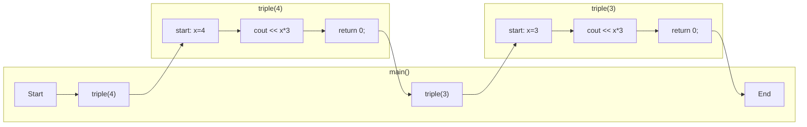

# 5.2. 引数

関数に値を渡すときは、以下のように実装する。

```cpp:line-numbers
#include <iostream>
using namespace std;

int triple(int x) {
    cout << x*3 << endl;
    return 0;
}

int main() {
    triple(4);
    triple(3);
}
```

```
[output]
12
9
```

この関数に渡す値のことを **引数** と呼ぶ。
引数の型は `()` の内側で定義される（`(int x)` の部分）。



例えば string 型の引数を設定したいなら以下のように実装する。

```cpp:line-numbers
#include <iostream>
using namespace std;

int hello(string s) {
    cout << "Hello, " << s << endl;
    return 0;
}

int main() {
    hello("traP");
    hello("Takeno_hito");
}
```

```
[output]
Hello, traP
Hello, Takeno_hito
```

引数は複数個設定することもできる。

```cpp:line-numbers
#include <iostream>
using namespace std;

int add(int x, int y) {
    cout << x + y << endl;
    return 0;
}

int main() {
    int a = 5;
    int b = 10;
    add(4, 7);
    add(a, b);
}
```

```
[output]
11
15
```

引数は、関数内でしか使うことができない（関数を呼び出した側の変数は変わらない）。

```cpp:line-numbers
#include <iostream>
using namespace std;

int triple(int x) {
    x = x*3;
    return 0;
}

int main() {
    int x = 4;
    triple(4);

    cout << x << endl;
}

```

```
[output]
4
```

これについての詳細は「参照渡し」の節で扱う。

    
