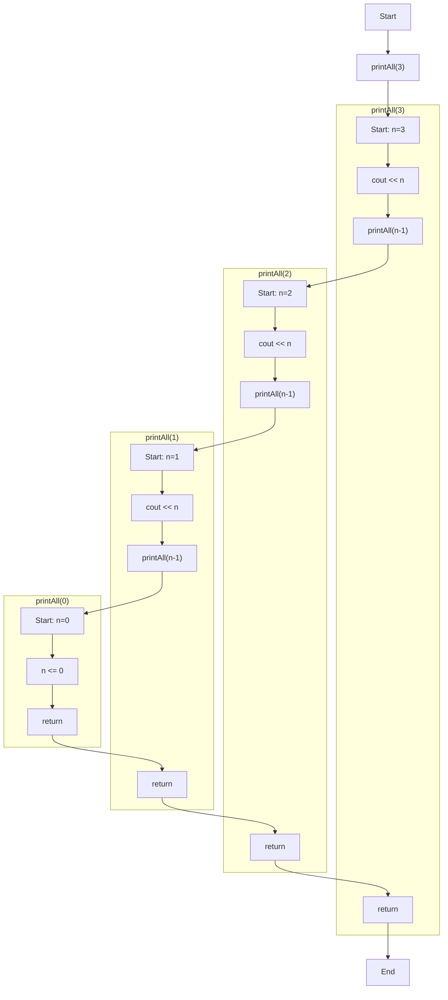

# 再帰関数

関数の中で関数を呼び出すことができる。

```cpp:line-numbers
#include <iostream>
using namespace std;

void printAll(int n) {
    if (n <= 0) return;
    cout << n << endl;
    printAll(n-1);
}

int main() {
    printAll(3);
}
```

```
[output]
3
2
1
```

かなり長いが、フローチャートで表すと下図のようになる。



気をつけるべきことは、複数ある `printAll(int n)` はそれぞれ独立して変数を持っているということである。

関数の中で関数を書くと、循環参照みたいなイメージがあって混乱するかもしれない。
そのような時は、1ステップずつ操作を確認していくとわかりやすいだろう。
今回は、各ステップに cout を挟んで、出力を確認しながら確かめてみる。

```cpp:line-numbers
#include <iostream>
using namespace std;

void printAll(int n) {
    cout << "L5: n=" << n << endl;

    if (n <= 0) return;
    cout << "L8: n=" << n << endl;

    cout << n << endl;
    cout << "L11: n=" << n << endl;

    printAll(n-1);
    cout << "L14: n=" << n << endl;
}

int main() {
    cout << "L18: in main function" << endl;
    printAll(3);
    cout << "L20: in main function" << endl;
}
```

```
[output]
L18: in main function
L5: n=3
L8: n=3
3
L11: n=3
L5: n=2
L8: n=2
2
L11: n=2
L5: n=1
L8: n=1
1
L11: n=1
L5: n=0
L14: n=1
L14: n=2
L14: n=3
L20: in main function
```
